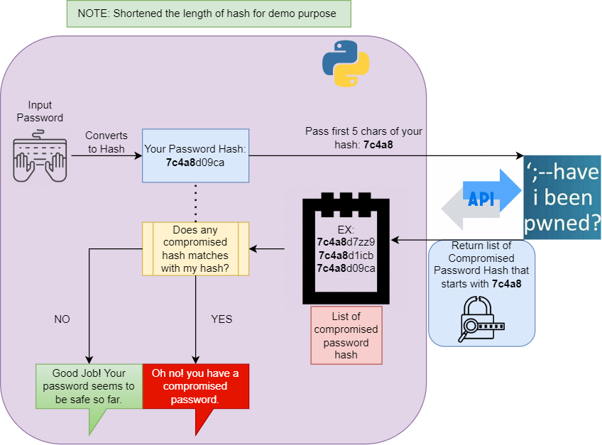
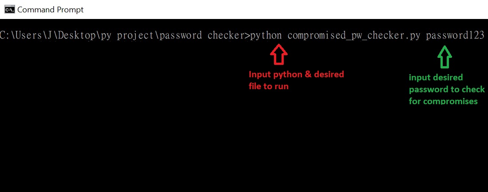
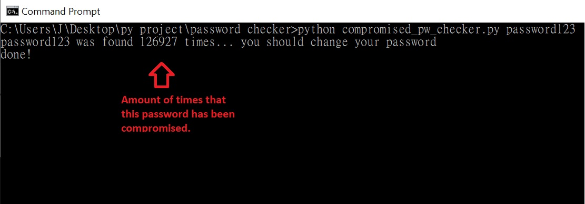

# Compromised Password Checker
This checks if your password has been hacked or not in previous data breaches by utilizing haveibeenpwned.com API

# Problem
You can check if your passwords have been compromised in previous data breaches with https://haveibeenpwned.com/Passwords. BUT, do you feel safe typing your password in a public site?

# Solution
You can have peace of mind by using the code that I provide to conduct the check, which is transparent on what it does.

The code allows you to check your password without the need to provide your full password hash for the API request to https://haveibeenpwned.com/. This means that no one will know which specific password is being checked.

# Illustration on how the code works:

# How to check your Password
1. Set up:
- Open a terminal and clone this repo, then make sure to cd into the directory that contains `compromised_pw_checker.py`

2. Check your password:
- in the terminal, run `python compromised_pw_checker.py YourPasswordHere`. You can also check multiple passwords at once by doing `python compromised_pw_checker.py password1 password2 password3 etc`

3. Example:

    Input:
    

    Output:
    

# Future Imrpovements:
- Implement an easy to use GUI.